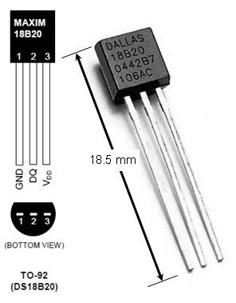
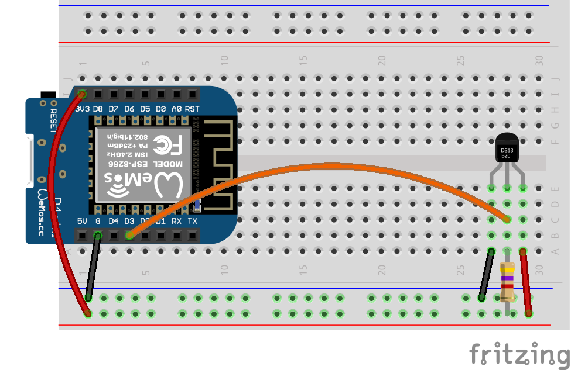

# Lab Exercise - ESP8266 and MQTT

This lab will introduce students to using MQTT with an ESP8266. A DS18B20 temperature sensor is also used in the lab.

### MQTT

MQTT (MQ Telemetry Transport) is a lightweight publish/subscribe messaging protocol.

### DS18B20 Temperature Sensor

The DS18B20 digital thermometer provides 9-bit to 12-bit Celsius temperature measurements in the range -55°C to +125°C. The DS18B20 uses a 1-wire serial protocol. Multiple devices can share the same 1-wire bus as each device has a unique 64-bit serial code. The DS18B20 can be powered by a supply between 3.0V and 5.5V.

## Exercise 1

First, we will build and test a circuit using the temperature sensor.

#### Components Needed
* DS18B20 temperature sensor
* 4k7 resistor
* connecting wires
* esp8266 development board (e.g. Wemos D1 mini)

### Instructions

1. Wire up the components as shown in the diagrams. The data line (DQ) needs to be pulled high using a 4k7 ohm resistor.
   
   
    
   

   ### Default Pin Wiring

    | Pin No | Function | Device Connection |
    | --- | --- | --- |
    | 3V3 | +3.3V | Vdd |
    | G | GND | GND |
    | D3 | GPIO 0 | DQ |

2. Make sure the temperature sensor is wired the correct way round!

3. Arduino IDE: Open the [ds18b20-simple](arduino/ds18b20-simple/ds18b20-simple.ino) sketch and run it.

   Micropython: Upload the `temp_readings.py` and `lib` folder to the D1 mini and run the `temp_readings.py` file.

4. Open the serial monitor and check that the sensor is working correctly.

Q1. What cable carries the data?

Q2. What libraries are needed to run this sketch?

Q3. What are libraries (in this context)? How are they helpful?

## Exercise 2

This exercise will add WiFi connection and MQTT publishing.

### Instructions

1. Open the [ds18b20-to-mqtt](arduino/ds18b20-to-mqtt/ds18b20-to-mqtt.ino) sketch and read through the code. Try to understand what each part of the sketch is doing.

2. The IP address of the MQTT broker is "192.168.4.1". Update the sketch settings to use this IP address.

3. Run the sketch.

4. Open the serial monitor and check that the sensor is working correctly, that the device has connected to the MQTT broker and is publishing messages. 

5. Open an MQTT monitor. There is one available on the Moodle page called "MQTT Explorer".

6. Connect the MQTT monitor to the broker being used.

7. Look at the messages being generated under the "mqtt-lab" topic.

Q4. What can you say about the messages being generated?

Q5. What problems can you see?

## Exercise 3

### Instructions

1. Together with the rest of the class, define standards for topics and messages that would allow all sensor readings to be identifable.

2. Impliment the standards in your sketch.
